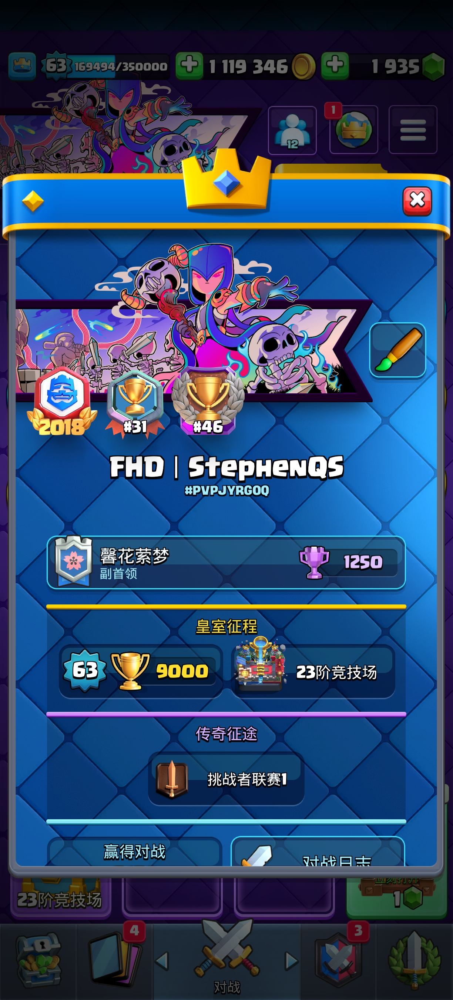
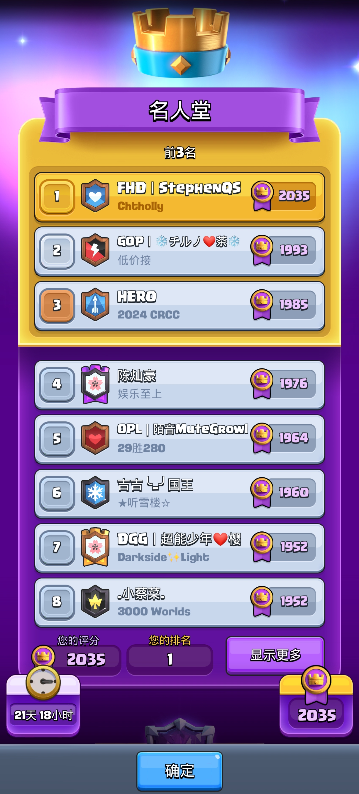
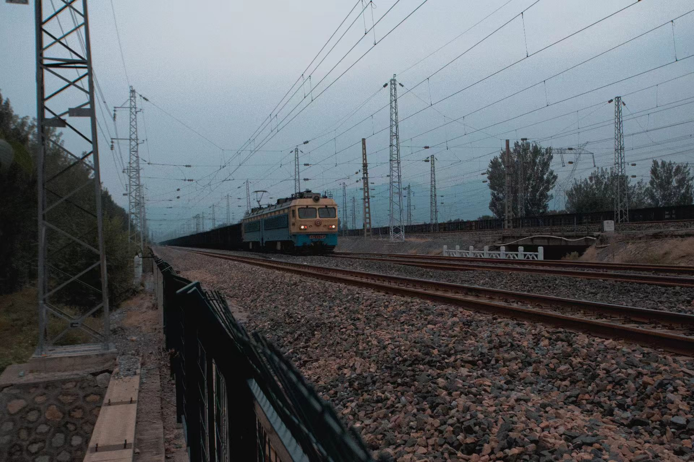
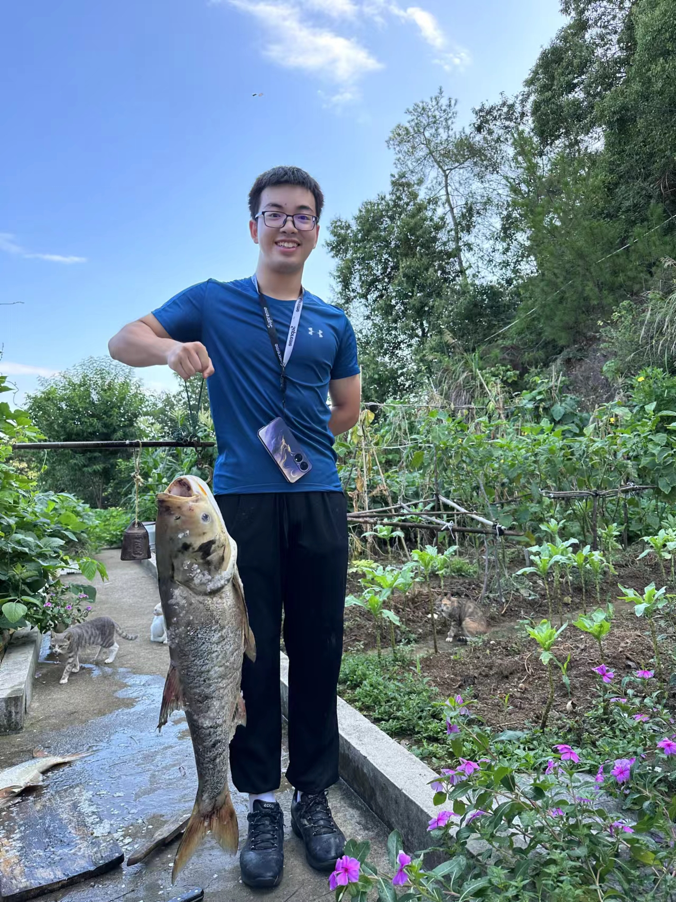

Hi, I'm Shi Qiu (仇是), a junior student at the School of Physics, Peking University. My research interests include the alignment and application of Large Language Models (LLMs) and Vision-Language Models (LVLMs). I am currently an intern with [Prof. Huaxiu Yao](https://www.huaxiuyao.io)'s team at UNC, where I contribute to cutting-edge AI research.

---

# 🔥 News
- *2024*: Excellence in Research Award for contributions in AI and intelligent systems.

---

# 📝 Publications

[1] Agents: An Open-source Framework for Autonomous Language Agents  
Wangchunshu Zhou, Yuchen Eleanor Jiang, Long Li, Jialong Wu, Shi Qiu, etc.  
Submitted on arXiv, September 2023  
[Link to paper](https://arxiv.org/abs/2309.07870)  
[Project Link](https://github.com/aiwaves-cn/agents)

---

# 🎖 Honors and Awards

- 🏅 Shu Qi Scholarship (top 5%) - *2023*  
- 🏆 Youth Award for Athletics (Physics Major Representative) - *2023*  
- 🥇 Excellence in Research Award - *2024*

---

# 📖 Education

**Peking University**  
*Beijing, China*  
*School of Physics & School of Electronics Engineering and Computer Science*  
*2022--*  
- Overall GPA: 3.58/4.0  

---

# 💼 Research Experience

**Undergraduate Research Program** (sorted by time)

- **CUPT Competition** 2023.3–5  
  - Third Prize in the CUPT (China Undergraduate Physics Tournament) School Competition, as one of the Main Speakers in the team.

- **Summer Internship at AIWaves** 2023.6–8  
  - Contributed to the development of the underlying code for an intelligent agent (AI-Agent) and co-authored a paper. Received 5k stars on GitHub.  
  - [Project Link](https://github.com/aiwaves-cn/agents)

- **Summer Internship at UNC** 2024.6–8  
  - Worked with [Prof. Huaxiu Yao](https://www.huaxiuyao.io) at the Department of Computer Science, UNC-Chapel Hill, as an assistant researcher. Contributed to multiple projects.

---

# 💻 Projects

### [LLM Agent](https://github.com/aiwaves-cn/agents) *2023.6–2023.8*  
Agents: An Open-source Framework for Autonomous Language Agents

### [CourseCommunity](https://github.com/StephenQSstarThomas/CourseCommunity) *2024.3–Present*  
CourseCommunity: An open-source, all-for-free platform providing university course notes and self-study guides.

---

# 🗺️ Skills
- **Programming:** Python, LaTeX, Markdown  
- **English:** TOEFL 112, CET-6 696, multiple internships in the US with significant English proficiency

---

# ⚽ Extracurricular Activities & Interests

- 🏆 **President of the Peking University Jump-Rope Team**  
  - **Achievements:** Led the team to 29th place in the National Online Jump Rope Competition and secured 3rd place in the Beijing Jump Rope Competition. 
  
- 🏸 **Member of the Badminton Team**  
  - **Achievements:** Contributed to the team's 3rd place victory in the Beijing University Cup Badminton Team Competition.

- 🏫 **Class Monitor** of Class 8 in the 22nd Undergraduate Cohort  
  - Managed class responsibilities, organized events, and facilitated communication between students and faculty.

- 🔗 **Key Member of the Peking University Blockchain Association**  
  - Actively engaged in discussions on blockchain technology and its potential applications in various industries.

- 📚 **Literature & Writing**  
  - Published a personal collection of essays, available at [Literature](https://github.com/StephenQSstarThomas/Literature).  
  - **Favorite Authors:** [Richard Powers](https://richardpowers.net), [Amor Towles](https://www.amortowles.com), [Anthony Doerr](https://www.anthonydoerr.com)

- 📸 **Photography**  
  - Collaborated with Mengshu Yu and Dannni Luo to create a unique series of self-made postcards, available at [Postcard](https://github.com/StephenQSstarThomas/Postcards).
   
  

- 🎮 **Games**  
  - **Clash Royale**  
    - Achieved Ladder rank #29 and Tournament rank #46 on the Chinese Server. Reached #1 using Evo RG, detailed in this [video](https://www.bilibili.com/video/BV1CS411K7nU).  
    - Team effort resulted in 3rd place in the Clash Royale Chinese University League (CRCUL) alongside Yikai Zhu, Hao Chen, Shibin Zhou, Luotian Yang, Yiming Liu, Haoxu Zhang, and others.  
     
    
     
     
    
     
  
  - **Battle of Balls**  
    - Ranked #7 on the ladder in Zhejiang Province, July 2018.

- 🚆 **Trains**  
  - A passionate train enthusiast.  
   
  

- 🎣 **Fishing**  
  - Enjoys fishing during leisure time.  
   
  
